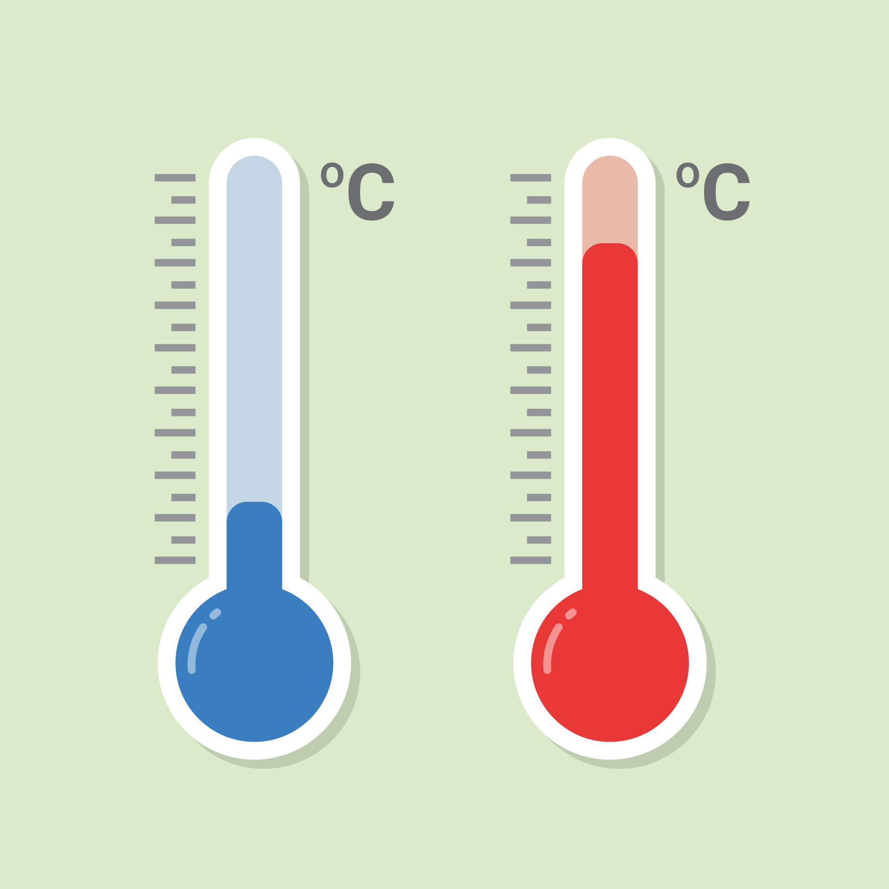

# 🌤️ Morocco Weather Predictor  

  

## 📌 Project Overview  
The **Morocco Weather Predictor** is a big data project that focuses on analyzing and predicting temperature variations across Moroccan cities.  
The system integrates multiple big data tools and machine learning techniques to handle real-time weather data from the **OpenWeather API**.  

Key features include:  
- ⚡ Real-time data ingestion with **Apache Kafka**.  
- 🗄️ Efficient data storage and preprocessing **Mongo DB**.
- 🔥 Real-time data transformation using **Apache Spark**.  
- 🤖 Predictive modeling with **Spark MLlib**.  
- 📊 Interactive visualization with **Streamlit**.  

This project demonstrates how big data technologies can be leveraged to create a scalable and intelligent weather forecasting system.  

---

## 📂 Project Structure  

Morocco-Weather-Predictor/
│── 📄 README.md # Project documentation
│── Repport
| ├── 📄 Report.pdf # Detailed report of the project (in French)
│
├── Base code/
│ ├── producer_code1.py # Kafka producer: collects weather data from OpenWeather API
│ ├── extraire_lesdonnees_code2.py # Data extraction and preprocessing script
│ ├── traitementSPARK_code3.py # Real-time data processing & predictive modeling with Spark MLlib
│ ├── visualisation_code4.py # Streamlit dashboard for visualization (temperature trends, correlations)
│ └── temp.jpg # Sample visualization of temperature analysis
│
└── LICENSE.md # License file

---

## 📘 Project Files  

- **Report.pdf** → A detailed explanation of the project in French, covering methodology and results.  
- **producer_code1.py** → Implements Kafka producer to stream data from the OpenWeather API.  
- **extraire_lesdonnees_code2.py** → Extracts, cleans, and formats raw weather data.  
- **traitementSPARK_code3.py** → Processes data in real time using Spark and trains predictive models with Spark MLlib.  
- **visualisation_code4.py** → Builds an interactive dashboard with Streamlit for visualization of predictions and correlations.  
- **temp.jpg** → Example output showing temperature analysis.  

---

## 🛠️ Technologies Used  

- **Python**  
- **Apache Kafka** (data ingestion)  
- **Apache Spark & Spark MLlib** (real-time processing & machine learning)  
- **OpenWeather API** (weather data source)  
- **Streamlit** (data visualization)  
- **Mongo DB** (data storage)

---

## 📜 License  

This project is licensed under the **MIT License** – see the [LICENSE.md](LICENSE.md) file for details.  

---

## 🚀 Future Improvements  

- Add support for more weather indicators (humidity, wind speed, air pressure).  
- Deploy the system on a cloud platform (AWS, Azure, or GCP).  
- Improve model accuracy using deep learning approaches (LSTM/GRU).  
- Extend the dashboard with predictive maps of Moroccan regions.  
